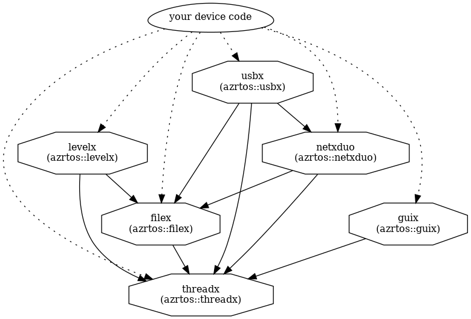

# Azure RTOS LevelX

LevelX provides NAND and NOR flash wear leveling facilities to embedded applications. Since both NAND and NOR flash memory can only be erased a finite number of times, it’s critical to distribute the flash memory use evenly. This is typically called “wear leveling” and is the purpose behind LevelX. LevelX presents to the user an array of logical sectors that are mapped to physical flash memory inside of LevelX. Applications may use LevelX in conjunction with FileX or may read/write logical sectors directly. LevelX is designed for fault tolerance. Flash updates are performed in a multiple-step process that can be interrupted in each step. LevelX automatically recovers to the optimal state during the next operation.

## Documentation

Documentation for this library can be found here: https://github.com/azure-rtos/levelx/releases/download/v6.0_rel/Azure_RTOS_LevelX_User_Guide.pdf

# Understanding inter-component dependencies

The main components of Azure RTOS are each provided in their own repository, but there are dependencies between them--shown in the following graph--that are important to understand when setting up your builds.



# Building and using the library

## Prerequisites

Install the following tools:

* [CMake](https://cmake.org/download/) version 3.0 or later
* [GCC compilers for arm-none-eabi](https://developer.arm.com/tools-and-software/open-source-software/developer-tools/gnu-toolchain/gnu-rm/downloads)
* [Ninja](https://ninja-build.org/)

## Cloning the repo

```bash
$ git clone https://github.com/azure-rtos/levelx.git
```

## Building as a static library

Each component of Azure RTOS comes with a composible CMake-based build system that supports many different MCUs and host systems. Integrating any of these components into your device app code is as simple as adding a git submodule and then including it in your build using the CMake command `add_subdirectory()`.

While the typical usage pattern is to include threadx into your device code source tree to be built & linked with your code, you can compile this project as a standalone static library to confirm your build is set up correctly.

```bash
$ cmake -Bbuild -DCMAKE_TOOLCHAIN_FILE=cmake/cortex_m4.cmake -GNinja .

$ cmake --build ./build
```

NOTE: You will have to take the dependency graph above into account when building anything other than threadx itself.

# Repository Structure and Usage

## Branches & Releases

The master branch has the most recent code with all new features and bug fixes. It does not represent the latest General Availability (GA) release of the library.

## Releases

Each official release (preview or GA) will be tagged to mark the commit and push it into the Github releases tab, e.g. `v6.0-rel`.

## Directory layout

```
- cmake
- common
  - inc
  - src
- samples
```

# Security

Azure RTOS provides OEMs with components to secure communication and to create code and data isolation using underlying MCU/MPU hardware protection mechanisms. It is ultimately the responsibility of the device builder to ensure the device fully meets the evolving security requirements associated with its specific use case.

# Licensing

License terms for using Azure RTOS are defined in the LICENSE.txt file of this repo. Please refer to this file for all definitive licensing information. No additional license fees are required for deploying Azure RTOS on hardware defined in the LICENSED-HARDWARE.txt file. If you are using hardware not defined in the LICENSED-HARDWARE.txt file or have licensing questions in general, please contact Microsoft directly at https://azure-rtos.ms-iot-contact.com/

# Contribution, feedback, issues, and professional support

If you encounter any bugs, have suggestions for new features, or if you would like to become an active contributor to this project, please follow the instructions provided in the contribution guideline for the corresponding repo.

For basic support, click Issues in the command bar or post a question to [Stack Overflow](http://stackoverflow.com/questions/tagged/azure-rtos+threadx) using the `threadx` and `azure-rtos` tags.

Professional support plans (https://azure.microsoft.com/en-us/support/options/) are available from Microsoft.

# Additional Resources

The following are references to additional Azure RTOS and Azure IoT in general:
|   |   |
|---|---|
| Azure RTOS Documenation and Guides: | https://docs.microsoft.com/azure/rtos |
| Azure RTOS Website: | https://azure.microsoft.com/services/rtos/ |
| Azure RTOS Sales Questions: | https://azure-rtos.ms-iot-contact.com/ |
| For technical questions check out Microsoft Q/A for Azure IoT: | https://aka.ms/QnA/azure-rtos |
| Internet of Things Show for latest announcements and online training: | https://aka.ms/iotshow |
| IoT Tech Community: | https://aka.ms/community/azure-rtos |
