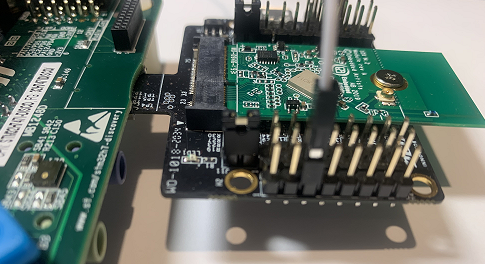

## <b>Nx_Iperf_wifi application description</b>

This application is a network traffic tool for measuring TCP and UDP performance with metrics around both throughput and latency.

The IP address of the target board to connect to is displayed on the UART.
The end-user can connect to it through an HTTP client browser and can interact with the Iperf utility running on the device through the web interface.


#### <b>Expected success behavior</b>
The HTTP client browser is able to connect and execute the use-cases that are proposed on the page.
Use-case can be started, and result of this use-case can be displayed also after end user request for it.

#### <b>Error behaviors</b>

None

#### <b>Assumptions if any</b>

- The application is using the DHCP to acquire IP address, thus a DHCP server should be reachable by the board in the LAN used to test the application.

#### <b>Known limitations</b>

Due to an unexpected side effect of the `NX_CHANGE_ULONG_ENDIAN` macro for the MDK-ARM IDE, UDP Transmit Test fails with this IDE.
However, the tests run fine with other IDEs.


#### <b>ThreadX usage hints</b>

- ThreadX uses the Systick as time base, thus it is mandatory that the HAL uses a separate time base through the TIM IPs.
- ThreadX is configured with 1000 ticks/sec, this should be taken into account when using delays or timeouts at application. It is always possible to reconfigure it in the `tx_user.h`, the `TX_TIMER_TICKS_PER_SECOND` define, but this should be reflected in `tx_initialize_low_level.S` file too.
- ThreadX is disabling all interrupts during kernel start-up to avoid any unexpected behavior, therefore all system related calls (HAL, BSP) should be done either at the beginning of the application or inside the thread entry functions.
- ThreadX offers the `tx_application_define()` function, that is automatically called by the tx_kernel_enter() API.
  It is highly recommended to use it to create all applications ThreadX related resources (threads, semaphores, memory pools...) but it should not in any way contain a system API call (HAL or BSP).
- Using dynamic memory allocation requires to apply some changes to the linker file.
  ThreadX needs to pass a pointer to the first free memory location in RAM to the `tx_application_define()` function, using the `first_unused_memory` argument.
  This requires changes in the linker files to expose this memory location.
    - For EWARM add the following section into the .icf file:
     ```
        place in RAM_region    { last section FREE_MEM };
     ```
    - For MDK-ARM:
    either define the RW_IRAM1 region in the ".sct" file
    or modify the line below in `tx_initialize_low_level.S` to match the memory region being used
    ```
        LDR r1, =|Image$$RW_IRAM1$$ZI$$Limit|
    ```
    - For STM32CubeIDE add the following section into the .ld file:
    ```
        ._threadx_heap :
        {
         . = ALIGN(8);
         __RAM_segment_used_end__ = .;
         . = . + 64K;
         . = ALIGN(8);
        } >RAM_D1 AT> RAM_D1
    ```

    The simplest way to provide memory for ThreadX is to define a new section, see ._threadx_heap above.
    In the example above the ThreadX heap size is set to 64KBytes.
    The `._threadx_heap` must be located between the `.bss` and the `._user_heap_stack sections` in the linker script.
    Caution: Make sure that ThreadX does not need more than the provided heap memory (64KBytes in this example).
    Read more in STM32CubeIDE User Guide, chapter: "Linker script".

    - The `tx_initialize_low_level.S` should be also modified to enable the `USE_DYNAMIC_MEMORY_ALLOCATION` compilation flag.

#### <b>NetX Duo usage hints</b>

For more details about the MPU configuration please refer to the [AN4838](https://www.st.com/resource/en/application_note/dm00272912-managing-memory-protection-unit-in-stm32-mcus-stmicroelectronics.pdf)


### <b>Keywords</b>

RTOS, Network, ThreadX, NetXDuo, WiFi, Station mode, TCP/UDP, microSD

### <b>Hardware and Software environment</b>

- This application runs on STM32H747xx devices.
- This application has been tested with STMicroelectronics STM32H747I-DISCO boards Revision: MB1248-H747I-D02
  and can be easily tailored to any other supported device and development board.

- A daughter board with the WiFi module is to be plugged into the microSD card connector CN12 of the STM32H747I-DISCO board.
- The daughterboard that was used is made up of:
  - A Murata uSD-M.2 Adapter Kit rev A (*J1 position 2-3, VBAT from microSD connector*)
  - The 1DX M.2 Module for the Cypress WiFi (CYW4343W)

> Connect *Pin 20 of STMod+ connector P2 of STM32H747I-DISCO* to the uSD M.2 Adapter (*J9 pin3 WL_REG_ON_HOST*) that supports the Cypress device
  as described with the below pictures:
  
<center>


<br/><br/>


</center>

- This application uses USART1 to provide a console for commands, the hyperterminal configuration is as follows:
  - BaudRate = 115200 baud
  - Word Length = 8 Bits
  - Stop Bit = 1
  - Parity = None
  - Flow control = None
  - Line endings set to LF (receive)

 - This application requires a WiFi access point to connect to:
    - With a transparent Internet connectivity: no proxy, no firewall blocking the outgoing traffic.
    - Running a DHCP server delivering the IP and DNS configuration to the board.

 - IPerf measures TCP/UDP bitrate between an Iperf client and an Iperf server.

 - This application can work as client(`Iperf -c <serverIP>`) or as a server (`Iperf -s`).

 - A third party application must run on the network to act as the Iperf server (or the Iperf client).

   A mobile phone running the "Iperf2 for Android" application has been tested.
   A PC running the "jperf 2.0.2" application has been tested.

### <b>How to use it?</b>

In order to make the program work, you must do the following:

- Open your preferred toolchain
- Edit the file `CM7/Core/Inc/cy_wifi_conf.h` to enter the name of your WiFi access point (`WIFI_SSID`) to connect to and its password (`WIFI_PASSWORD`).
- For each target configuration (Nx_Iperf_wifi_CM4 first then Nx_Iperf_wifi_CM7) : 
     - Rebuild all files 
     - Load images into target memory
- After loading the two images, you have to reset the board in order to boot (Cortex-M7) and CPU2 (Cortex-M4) at once.
- Run the application

- Open a browser window on a PC and type the target board's IP address you got from the serial terminal.
  This web page will provide an interface to the Iperf application running on the target board.

- Select any of the options on the web page for the target board to work as TCP/UDP client(transmit test) or as TCP/UDP server(receive test).

#### <b>Example1:</b>
 After selecting <b>"Start TCP Receive Test"</b> on the web page, launch third party iperf application command (`iperf -c <Target board's IP address>`).

 This will make Target board to act as TCP Server and third-party application as TCP Client.

log output on the client side using Jperf 2.0.2 on Windows PC:

   ```
bin/iperf.exe -c 192.168.55.12 -P 1 -i 1 -p 5001 -f k -t 10
------------------------------------------------------------
Client connecting to 192.168.55.12, TCP port 5001
TCP window size: 64.0 KByte (default)
------------------------------------------------------------
[404] local 192.168.55.206 port 54653 connected with 192.168.55.12 port 5001
[ ID] Interval       Transfer     Bandwidth
[404]  0.0- 1.0 sec   928 KBytes  7602 Kbits/sec
[404]  1.0- 2.0 sec  2120 KBytes  17367 Kbits/sec
[404]  2.0- 3.0 sec  2088 KBytes  17105 Kbits/sec
[404]  3.0- 4.0 sec  1984 KBytes  16253 Kbits/sec
[404]  4.0- 5.0 sec  2128 KBytes  17433 Kbits/sec
[404]  5.0- 6.0 sec  1976 KBytes  16187 Kbits/sec
[404]  6.0- 7.0 sec  2080 KBytes  17039 Kbits/sec
[404]  7.0- 8.0 sec  2056 KBytes  16843 Kbits/sec
[404]  8.0- 9.0 sec  2008 KBytes  16450 Kbits/sec
[404]  9.0-10.0 sec  2232 KBytes  18285 Kbits/sec
[404]  0.0-10.0 sec  19608 KBytes  16007 Kbits/sec
Done.
   ```

log output on the server side (select "Click here" on the web page to get results):

*TCP Receive Test Done:*

*Source IP Address: 192.168.55.206*

*Test Time(milliseconds): 9832*

*Number of Packets Received: 13878*

*Number of Bytes Received: 20078616*

*Throughput(Mbps): 16*


#### <b>Example2:</b>
 After selecting <b>"Start UDP Receive Test"</b> on the web page, launch third party iperf application command (`iperf -c <Target board's IP address> -u -b 50M`).

 This will make Target board to act as UDP Server and third-party application as UDP Client.

#### <b>Example3:</b>
 Launch third party iperf application command (`iperf -s`), now edit Destination IP address with the IP address of the device where third party
 application is running and select <b>"Start TCP transmit Test"</b> on the web page.

 This will make Target board to act as TCP Client and third-party application as TCP Server.

#### <b>Example4:</b>
 Launch third party iperf application command (`iperf -s -u`), now edit Destination IP address with the IP address of the device where third party
 application is running and select <b>"Start UDP transmit Test"</b> on the web page.

 This will make Target board to act as UDP Client and third-party application as UDP Server.


- Please refer to the following link for all the Iperf tests with example [Chapter 3 Running the Demonstration](https://docs.microsoft.com/en-us/azure/rtos/netx-duo/netx-duo-iperf/chapter3)
