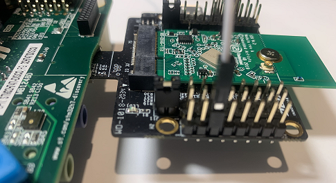
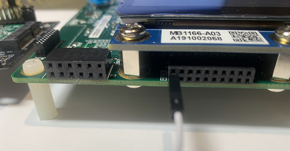

## <b>Nx_MQTT_Client_wifi application description</b>

This application provides an example of Azure RTOS NetX/NetXDuo stack usage.

It shows how to exchange data between client and server using MQTT protocol in an encrypted mode supporting TLS v1.2.

- a dns_client is created to be used as DNS server then it gets MQTT broker address from `MQTT_BROKER_NAME` predefined on `app_netxduo.h` file.
- a mqtt_client is created to connect to the online MQTT broker; connection with server will be secure and a **`tls_setup_callback`** will set the TLS parameters.
  By default, MQTT_PORT for encrypted mode is 8883.
  Refer to note below, to know how to setup an x509 certificate.
- the mqtt_client subscribes on a predefined topic `TOPIC_NAME` "stm32_rng_value" with a Quality Of Service `QOS0`
- depending on the number of messages `NB_MESSAGE` defined by the user, mqtt_client will publish a random number generated by RNG.
  If `NB_MESSAGE` = 0, it means that number of messages is infinitely.

- the mqtt_client will get messages from the MQTT broker and print them.

#### <b>Expected success behavior</b>

 - The board IP address is printed on the HyperTerminal
 - Connection's information are printed on the HyperTerminal (broker's name, MQTT port, topic and messages received)
 ```
MQTT client connected to broker < test.mosquitto.org > at PORT:  8883
[007601] Message 01 received: TOPIC = "stm32_rng_value", MESSAGE = "6628"
[010786] Message 02 received: TOPIC = "stm32_rng_value", MESSAGE = "5742"
[011827] Message 03 received: TOPIC = "stm32_rng_value", MESSAGE = "2521"
[014780] Message 04 received: TOPIC = "stm32_rng_value", MESSAGE = "2906"
[015823] Message 05 received: TOPIC = "stm32_rng_value", MESSAGE = "7921"
[018774] Message 06 received: TOPIC = "stm32_rng_value", MESSAGE = "0535"
[019814] Message 07 received: TOPIC = "stm32_rng_value", MESSAGE = "4004"
[020852] Message 08 received: TOPIC = "stm32_rng_value", MESSAGE = "0401"
[021895] Message 09 received: TOPIC = "stm32_rng_value", MESSAGE = "7454"
[022938] Message 10 received: TOPIC = "stm32_rng_value", MESSAGE = "7653"
[023945] Empty message published at end
Client disconnected from broker < test.mosquitto.org >.
 ```
 - The green LED is toggling after successfully receiving all messages.

#### <b>Error behaviors</b>

- The red LED is toggling to indicate any error that has occurred.

#### <b>Assumptions if any</b>

None

#### <b>Known limitations</b>
- Since NetXDuo does not support proxy, mqtt_client should be connected directly to the server.

### <b>Notes</b>

 To make an encrypted connection with MQTT server, user should follow these steps to add an x509 certificate to the mqtt_client and use it to ensure server's authentication:

 - download certificate authority CA (in this application "mosquitto.org.der" downloaded from [test.mosquitto](https://test.mosquitto.org)
 - convert certificate downloaded by executing the following cmd from the file downloaded path:
   `xxd.exe -i mosquitto.org.der > mosquitto.cert.h`
 - add the converted file under the application: `NetXDuo/Nx_MQTT_Client/NetXDuo/App`
 - configure `MOSQUITTO_CERT_FILE` with your certificate name.

#### <b>ThreadX usage hints</b>

- ThreadX uses the Systick as time base, thus it is mandatory that the HAL uses a separate time base through the TIM IPs.
- ThreadX is configured with 1000 ticks/sec, this should be taken into account when using delays or timeouts at application. It is always possible to reconfigure it in the `tx_user.h`, the `TX_TIMER_TICKS_PER_SECOND` define, but this should be reflected in `tx_initialize_low_level.S` file too.
- ThreadX is disabling all interrupts during kernel start-up to avoid any unexpected behavior, therefore all system related calls (HAL, BSP) should be done either at the beginning of the application or inside the thread entry functions.
- ThreadX offers the `tx_application_define()` function, that is automatically called by the tx_kernel_enter() API.
  It is highly recommended to use it to create all applications ThreadX related resources (threads, semaphores, memory pools...) but it should not in any way contain a system API call (HAL or BSP).
- Using dynamic memory allocation requires to apply some changes to the linker file.
  ThreadX needs to pass a pointer to the first free memory location in RAM to the `tx_application_define()` function, using the `first_unused_memory` argument.
  This requires changes in the linker files to expose this memory location.
    - For EWARM add the following section into the .icf file:
     ```
        place in RAM_region    { last section FREE_MEM };
     ```
    - For MDK-ARM:
    either define the RW_IRAM1 region in the ".sct" file
    or modify the line below in `tx_initialize_low_level.S` to match the memory region being used
    ```
        LDR r1, =|Image$$RW_IRAM1$$ZI$$Limit|
    ```
    - For STM32CubeIDE add the following section into the .ld file:
    ```
        ._threadx_heap :
        {
         . = ALIGN(8);
         __RAM_segment_used_end__ = .;
         . = . + 64K;
         . = ALIGN(8);
        } >RAM_D1 AT> RAM_D1
    ```

    The simplest way to provide memory for ThreadX is to define a new section, see ._threadx_heap above.
    In the example above the ThreadX heap size is set to 64KBytes.
    The `._threadx_heap` must be located between the `.bss` and the `._user_heap_stack sections` in the linker script.
    Caution: Make sure that ThreadX does not need more than the provided heap memory (64KBytes in this example).
    Read more in STM32CubeIDE User Guide, chapter: "Linker script".

    - The `tx_initialize_low_level.S` should be also modified to enable the `USE_DYNAMIC_MEMORY_ALLOCATION` compilation flag.

#### <b>NetX Duo usage hints</b>

For more details about the MPU configuration please refer to the [AN4838](https://www.st.com/resource/en/application_note/dm00272912-managing-memory-protection-unit-in-stm32-mcus-stmicroelectronics.pdf)


### <b>Keywords</b>

RTOS, Network, ThreadX, NetXDuo, WiFi, MQTT, DNS, NTP, TLS, Station mode, microSD

### <b>Hardware and Software environment</b>

- This application runs on STM32H747xx devices.
- This application has been tested with STMicroelectronics STM32H747I-DISCO boards Revision: MB1248-H747I-D02
  and can be easily tailored to any other supported device and development board.

- A daughter board with the WiFi module is to be plugged into the microSD card connector CN12 of the STM32H747I-DISCO board.
- The daughterboard that was used is made up of:
  - A Murata uSD-M.2 Adapter Kit rev A (*J1 position 2-3, VBAT from microSD connector*)
  - The 1DX M.2 Module for the Cypress WiFi (CYW4343W)

> Connect *Pin 20 of STMod+ connector P2 of STM32H747I-DISCO* to the uSD M.2 Adapter (*J9 pin3 WL_REG_ON_HOST*) that supports the Cypress device
  as described with the below pictures:
  
<center>


<br/><br/>


</center>

- This application uses USART1 to display logs, the hyperterminal configuration is as follows:
  - BaudRate = 115200 baud
  - Word Length = 8 Bits
  - Stop Bit = 1
  - Parity = None
  - Flow control = None
  - Line endings set to LF (receive).

### <b>How to use it ?</b>

In order to make the program work, you must do the following:

- Open your preferred toolchain
- Edit the file `CM7/Core/Inc/cy_wifi_conf.h` to enter the name of your WiFi access point (`WIFI_SSID`) to connect to and its password (`WIFI_PASSWORD`).
- Edit the file `CM7/NetXDuo/App/app_netxduo.h`: define the `MQTT_BROKER_NAME` and `NB_MESSAGE`.
- For each target configuration (Nx_MQTT_Client_wifi_CM4 first then Nx_MQTT_Client_wifi_CM7) : 
     - Rebuild all files 
     - Load images into target memory
- After loading the two images, you have to reset the board in order to boot (Cortex-M7) and CPU2 (Cortex-M4) at once.
- Run the application