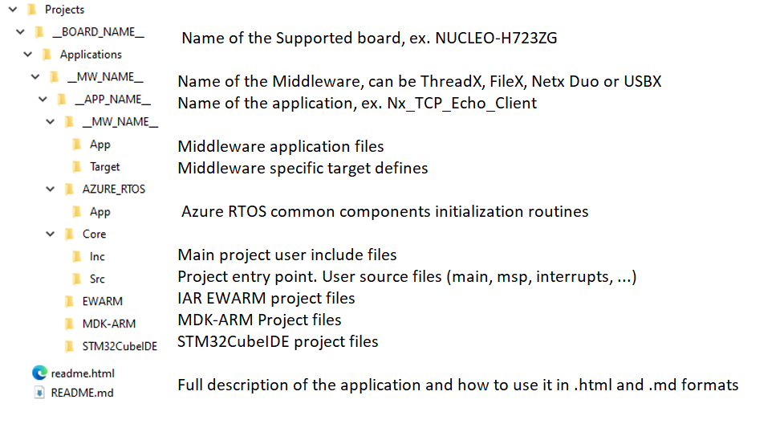

# X-CUBE-AZRTOS-H7 Azure RTOS Software Expansion for STM32Cube

With Azure RTOS complementing the extensive STM32Cube ecosystem providing free development tools, software bricks, and software expansion packages, STM32 users can also leverage the rich services of Azure RTOS, which meet the needs of tiny, smart, connected devices.

**X-CUBE-AZRTOS-H7** (Azure RTOS Software Expansion for STM32Cube) provides a full integration of **Microsoft Azure RTOS** in the STM32Cube environment for the STM32H7 series of microcontrollers. Ready-to-run applicative examples are also provided for the *NUCLEO-H723ZG*, *STM32H735G-DK*, *STM32H747I-DISCO* and *STM32H743I-EVAL* evaluation boards, thus **reducing the learning curve** and ensuring a **smooth application development experience** with Azure RTOS and STM32H7 MCUs.

The scope of this package covers the following Azure RTOS middleware: RTOS (***ThreadX***), USB Device and Host (***USBX***), File System including NOR/NAND memories support (***FileX*** and ***LevelX***) and Networking with Ethernet (***NetXDuo***).

Azure RTOS is a professional grade, highly reliable and market proven Middleware suite:
 - **Integrated** and full featured **RTOS**. Learn more [_ThreadX_](https://github.com/eclipse-threadx/rtos-docs/blob/main/rtos-docs/threadx/index.md).
 - **Industrial grade** networking stack: optimized for performance coming with **many IoT protocols.** Learn more [_Netx Duo_](https://github.com/eclipse-threadx/rtos-docs/blob/main/rtos-docs/netx-duo/index.md)
 - Advanced FS/FTL: **fully featured** to support **NAND/NOR Flash** memories. Learn more [_FileX_](https://github.com/eclipse-threadx/rtos-docs/blob/main/rtos-docs/filex/index.md)  _and_  [_LevelX_](https://github.com/eclipse-threadx/rtos-docs/blob/main/rtos-docs/levelx/index.md)
 - USB **Host** and **Device** stacks coming with **multiple classes.** Learn more [_USBX_](https://github.com/eclipse-threadx/rtos-docs/blob/main/rtos-docs/usbx/index.md)
 - **Safety pre-certifications (from Microsoft)**: IEC 61508 SIL4, IEC 62304 Class C and ISO 26262 ASIL D
 - **Security pre-certifications (from Microsoft)**: EAL4+ for TLS/DTLS, FIPS 140-2 for SW crypto lib
 - STM32 **granted production license:** [_here_](https://github.com/azure-rtos/threadx/blob/master/LICENSED-HARDWARE.txt)

### Prerequisites
- USBX, FileX and NetXDuo building requires ThreadX as they are based on RTOS model.
- USBX Host MSC requires FileX Middleware usage
- USBX Device ECM/RNDIS classes require NetXDuo usage

One of the following toolchains:

- IAR Embedded Workbench for ARM (EWARM) toolchain 8.50.9 + ST-LINKV3
- [STM32CubeIDE V1.19.0](https://www.st.com/en/development-tools/stm32cubeide.html) + ST-LINKV3
- RealView Microcontroller Development Kit (MDK-ARM) toolchain V5.39 + ST-LINKV3

## Supported Devices and Boards by applications
- [NUCLEO-H723ZG](https://www.st.com/en/evaluation-tools/nucleo-h723zg.html) *(MB1364-E01)*
- [STM32H735G-DK](https://www.st.com/en/evaluation-tools/stm32h735g-dk.html) *(MB1520-B02)*
- [STM32H747I-DISCO](https://www.st.com/en/evaluation-tools/stm32h747i-disco.html) *(MB1248-D01)*
- [STM32H743I-EVAL](https://www.st.com/en/evaluation-tools/stm32h743i-eval.html) *(MB1246-B03)*

## Repository structure
The STMicroelectronics GitHub X-CUBE-AZRTOS repository consists of the following repositories:
- **Drivers**: contains STM32H7 CMSIS, HAL and BSP drivers
- **Middlewares**: contains ThreadX, NetX Duo, FileX, LevelX and USBX stacks including porting on STM32 hardware
- **Projects**: provides ready-to-run applicative examples for Azure RTOS on the supported boards. Projects are structured as follows:

## Documentation
More comprehensive documentation is available on STM32 [MCU Wiki](https://wiki.st.com/stm32mcu/wiki/STM32CoreMW_overview).

## License
Azure RTOS is distributed by Microsoft under [GitHub](https://github.com/azure-rtos) and under Microsoft license.
STMicroelectronics include Azure RTOS in selected STM32Cube software packages, whether delivered by Microsoft under GitHub, or by STMicroelectronics through STM32 CubeFW packages on www.st.com or GitHub, proprietary license terms are the same between Microsoft and User:
-	Source code is available
-	User is granted modification
-	User is granted redistribution of source (modified or not) and/or binary, provided he develops on an MCU/MPU that is listed officially by Microsoft
-	User is granted production, provided he develops on an MCU that is listed officially by Microsoft: [Licensed Hardware](https://github.com/azure-rtos/threadx/blob/master/LICENSED-HARDWARE.txt)
-	User is forbidden to reuse provided software to create a competing offer
Whenever a new STM32 series includes support for Azure RTOS, it is added by Microsoft in the official list

By using STM32H7 Series you inherit the “Distribution and Production Use” rights in Section 2 of the Microsoft Software License Terms for Azure RTOS.

For more details about license information relative to each component in this package, please refer to [LICENSE](./LICENSE.md)

## Release note

Details about the content of this release are available in the release note [here](https://htmlpreview.github.io/?https://github.com/STMicroelectronics/x-cube-azrtos-h7/blob/main/Release_Notes.html).

## Applications
| Middleware   |  Applications                    |       Short Description      |
|--------------|----------------------------------|------------------------------|
|ThreadX | Tx_Thread_Creation            | It demonstrates how to create and destroy multiple threads using Azure RTOS ThreadX APIs. In addition, it shows how to use preemption threshold between threads and change priorities on-fly. [readme](./Projects/NUCLEO-H723ZG/Applications/ThreadX/Tx_Thread_Creation/README.md) |
|ThreadX | Tx_Thread_Sync                | It demonstrates how to synchronize between threads using binary semaphores or mutexes. [readme](./Projects/STM32H735G-DK/Applications/ThreadX/Tx_Thread_Sync/README.md) |
|ThreadX | Tx_Thread_MsgQueue            | It demonstrates how to exchange message between threads using Message Queue API and how to handle message from different queues using event queue chaining feature. [readme](./Projects/NUCLEO-H723ZG/Applications/ThreadX/Tx_Thread_MsgQueue/README.md) |
|ThreadX | Tx_FreeRTOS_Wrapper           | It demonstrates how to create threads using the FreeRTOS wrapper APIs. [readme](./Projects/STM32H735G-DK/Applications/ThreadX/Tx_FreeRTOS_Wrapper/README.md) |
|ThreadX | Tx_CMSIS_Wrapper              | It demonstrates how CMSIS RTOS adaptation layer for Azure RTOS ThreadX, it shows how to develop an application using the CMSIS RTOS 2 APIs. [readme](./Projects/STM32H747I-DISCO/Applications/ThreadX/Tx_CMSIS_Wrapper/README.md) |
|ThreadX | Tx_LowPower                   | It demonstrates how to configure the LowPower feature of Azure RTOS ThreadX stack. In addition, it shows how to use ThreadX MACRO related to the LowPower feature. [readme](./Projects/NUCLEO-H723ZG/Applications/ThreadX/Tx_LowPower/README.md) |
|ThreadX | Tx_MPU                        | It demonstrates how to load, start and unload modules. In addition, it shows how ThreadX memory protection on modules using the Memory Protection Unit (MPU). [readme](./Projects/STM32H747I-DISCO/Applications/ThreadX/Tx_MPU/README.md) |
|USBX    | Ux_Host_MSC                   | It demonstrates how to develop USB Host Mass Storage "MSC" able to enumerate and communicates with a removable usb flash disk. The application is designed to behave as an USB MSC Host able to operate with an USB flash disk using the Bulk Only Transfer (BOT) and Small Computer System Interface (SCSI) transparent commands combined with a file system Azure RTOS FileX.  [readme](./Projects/STM32H735G-DK/Applications/USBX/Ux_Host_MSC/README.md) |
|USBX    | Ux_Host_HID                   | It demonstrates how to develop USB Host Human Interface "HID" able to enumerate and communicates with a mouse or a keyboard. The application is designed to behave as an USB HID Host, the code provides required requests to properly enumerate HID devices , HID Class APIs to decode HID reports received from a mouse or a keyboard and display data on uart HyperTerminal.  [readme](./Projects/NUCLEO-H723ZG/Applications/USBX/Ux_Host_HID/README.md) |
|USBX    | Ux_Host_CDC_ACM               | It demonstrates how to develop USB Host CDC ACM device able to properly enumerate CDC devices then send and receive data that can be displayed on Hyperterminal or alike. [readme](./Projects/NUCLEO-H723ZG/Applications/USBX/Ux_Host_CDC_ACM/README.md) |
|USBX    | Ux_Device_MSC                 | It demonstrates how to develop USB Device mass storage class based application. The application is designed to emulate an USB MSC device, the code provides all required device descriptors framework and the associated Class descriptor report to build a compliant USB MSC device  [readme](./Projects/STM32H735G-DK/Applications/USBX/Ux_Device_MSC/README.md) |
|USBX    | Ux_Device_CDC_ACM             | It demonstrates how to develop USB Device communication Class "CDC_ACM" based application. The application is designed to emulate an USB-to-UART bridge following the Virtual COM Port (VCP) implementation, the code provides all required device descriptors framework and associated Class descriptor report to build a compliant USB CDC_ACM device. [readme](./Projects/NUCLEO-H723ZG/Applications/USBX/Ux_Device_CDC_ACM/README.md). |
|USBX    | Ux_Device_HID                 | It demonstrates how to develop USB Device Human Interface "HID" mouse based application. The application is designed to emulate an USB HID mouse device, the code provides all required device descriptors framework and associated Class descriptor report to build a compliant USB HID mouse device. [readme](./Projects/NUCLEO-H723ZG/Applications/USBX/Ux_Device_HID/README.md)  |
|USBX    | Ux_Device_CDC_ECM             | It demonstrates how to develop USB Device CDC ECM communication. It shows how to run Web HTTP server based application stack over USB interface using USB CDC ECM protocol. [readme](./Projects/STM32H735G-DK/Applications/USBX/Ux_Device_CDC_ECM/README.md)  |
|USBX    | Ux_Host_DualClass             | It demonstrates how to develop USB Host supporting two device classes: USB_HID (mouse or keyboard) and USB_MSC (removable flash disk). [readme](./Projects/STM32H735G-DK/Applications/USBX/Ux_Host_DualClass/README.md) |
|USBX    | Ux_Device_HID_CDC_ACM         | It demonstrates how to develop a composite USB Device application. The application is designed to emulate a USB HID mouse combined with an USB-to-UART bridge following the Virtual COM Port (VCP) implementation, the code provides all required device descriptors framework and associated Class descriptor report to build a compliant composite USB HID and CDC_ACM device. [readme](./Projects/STM32H747I-DISCO/Applications/USBX/Ux_Device_HID_CDC_ACM/README.md). |
|USBX    | Ux_Device_DFU                 | It demonstrates how to develop USB Device Firmware Upgrade "DFU" based application. The application is designed to emulate an USB DFU device, the code provides all required device descriptors framework and associated Class descriptor report to build a compliant USB DFU device. [readme](./Projects/NUCLEO-H723ZG/Applications/USBX/Ux_Device_DFU/README.md) |
|USBX    | Ux_Host_HID_CDC_ACM           | It demonstrates how to develop a composite "USB HID CDC_ACM Host" that is able to enumerate and communicate with composite USB HID CDC_ACM and simple HID/CDC_ACM devices. [readme](./Projects/STM32H735G-DK/Applications/USBX/Ux_Host_HID_CDC_ACM/README.md) |
|USBX    | Ux_Device_Video               | It demonstrates how to develop a basic USB Device Video based application. The application is designed to emulate an USB VIDEO device, the code provides all required device descriptors framework and associated Class descriptor report to build a compliant USB VIDEO device. [readme](./Projects/NUCLEO-H723ZG/Applications/USBX/Ux_Device_Video/README.md) |
|USBX    | Ux_Device_DualHID             | It demonstrates how to develop a composite USB Device Human Interface Device Class “HID Mouse” and “HID Keyboard” based application. The application is designed to emulate an USB HID Composite mouse & keyboard device , the code provides all required device descriptors framework and associated Class descriptor report to build a compliant USB HID Composite device. [readme](./Projects/STM32H747I-DISCO/Applications/USBX/Ux_Device_DualHID/README.md) |
|USBX    | Ux_Device_CustomHID           | It demonstrates how to develop USB Device Human Interface “HID” Custom based application. The application is designed to emulate an USB HID Custom device, the code provides all required device descriptors framework and associated Class descriptor report to build a compliant USB HID Custom device. [readme](./Projects/STM32H743I-EVAL/Applications/USBX/Ux_Device_CustomHID/README.md) |
|USBX    | Ux_Device_RNDIS               | It demonstrates how to run Web HTTP server based application stack over USB interface. The application is designed to load files and web pages stored in SD card using a Web HTTP server through USB RNDIS interface class, the code provides all required features to build a compliant Web HTTP Server. [readme](./Projects/STM32H735G-DK/Applications/USBX/Ux_Device_RNDIS/README.md) |
|USBX    | Ux_Device_PIMA_MTP            | It demonstrates how to develop USB Device Media Transfer Protocol class based application. The application is designed to emulate an USB PIMA MTP device, the code provides all required device descriptors framework and the associated Class descriptor report to build a compliant USB MTP device. [readme](./Projects/STM32H735G-DK/Applications/USBX/Ux_Device_PIMA_MTP/README.md) |
|USBX    | Ux_Device_CCID                | It demonstrates how to develop USB Device for Integrated Circuit Card Interface Device based application. The application is designed to emulate a smart card reader device, the code provides all required device descriptors framework and associated Class descriptor to build a USB CCID device. [readme](./Projects/NUCLEO-H723ZG/Applications/USBX/Ux_Device_CCID/README.md) |
|USBX    | Ux_Device_Printer             | It demonstrates how to develop USB Device Printer Class based application. The application is designed to emulate a USB Printer device, the code provides all required device descriptors framework and the associated Class descriptor report to build a compliant USB Printer device. [readme](./Projects/STM32H735G-DK/Applications/USBX/Ux_Device_Printer/README.md) |
|USBX    | Ux_Device_HID_Standalone      | It demonstrates how to develop USB Device Human Interface “HID” mouse based bare metal application. The application is designed to emulate an USB HID mouse device, the code provides all required device descriptors framework and associated Class descriptor report to build a compliant USB HID mouse device. [readme](./Projects/NUCLEO-H723ZG/Applications/USBX/Ux_Device_HID_Standalone/README.md) |
|USBX    | Ux_Host_HID_Standalone        | It demonstrates how to develop bare metal USB Host Human Interface “HID” able to enumerate and communicates with a mouse or a keyboard. The application is designed to behave as an USB HID Host, the code provides required requests to properly enumerate HID devices , HID Class APIs to decode HID reports received from a mouse or a keyboard and display data on uart HyperTerminal. [readme](./Projects/NUCLEO-H723ZG/Applications/USBX/Ux_Host_HID_Standalone/README.md) |
|USBX    | Ux_Host_HUB_HID_MSC           | It demonstrates how to develop a USB Host Hub application supporting Human Interface “HID” and Mass Storage “MSC” class drivers to be able to enumerate and communicate with: - An USB hub. - A mouse. - A keyboard. - An USB removable flash disk. [readme](./Projects/STM32H747I-DISCO/Applications/USBX/Ux_Host_HUB_HID_MSC/README.md) |
|USBX    | Ux_Device_Audio2.0_PlayBack   | It demonstrates how to develop USB Device communication Class "AUDIO" based application.The application is designed to emulate an USB (Out: Speaker/Headset), the code provides all required device descriptors framework and associated Class descriptor report to build a compliant USB AUDIO device. [readme](./Projects/STM32H743I-EVAL/Applications/USBX/Ux_Device_Audio2.0_PlayBack/README.md) |
|USBX    | Ux_Host_Audio                 | It demonstrates how to develop AUDIO" able to enumerate and communicates with a device audio speaker 1.0/2.0. [readme](./Projects/STM32H747I-DISCO/Applications/USBX/Ux_Host_Audio/README.md) |
|FileX   | Fx_uSD_File_Edit              | It demonstrates how to develop a basic SD card file operations application. The application is designed to handle SD card insertion/removal events, and depending on that state, it starts and stops file operations from and into the SD card. [readme](./Projects/STM32H735G-DK/Applications/FileX/Fx_uSD_File_Edit/README.md)  |
|FileX   | Fx_MultiAccess                | It demonstrates how the FileX's concurrent file access capabilities. The application is designed to execute file operations on the SD card device, the code provides all required software code for handling SD card I/O operations. [readme](./Projects/STM32H735G-DK/Applications/FileX/Fx_MultiAccess/README.md) |
|FileX   | Fx_NoR_Write_Read_File        | It demonstrates how to create a Fat File system on the NOR flash using FileX alongside LevelX. The application is designed to execute file operations on the MX25LM51245G NOR flash device, the code provides all required software code for properly managing it. [readme](./Projects/STM32H735G-DK/Applications/FileX/Fx_NoR_Write_Read_File/README.md) |
|FileX   | Fx_DualInstance               | It demonstrates how the coexistence capability of two FileX/LevelX stacks running independently on each core. [readme](./Projects/STM32H747I-DISCO/Applications/FileX/Fx_Dual_Instance/README.md) |
|FileX   | Fx_IAP                        | It demonstrates how to implement an In-Application programming (IAP) using FileX's SD file access capabilities. The application is designed to erase and write to on-chip flash memory, it provides all required software code for handling SD card and flash memory I/O operations. This is a typical application on how to use the SD card peripheral for firmware upgrade application or IAP, allowing user to erase and write to on-chip flash memory. [readme](./Projects/STM32H735G-DK/Applications/FileX/FX_IAP/IAP_main/README.md) |
|FileX   | Fx_File_Edit_Standalone       | It demonstrates how to create a Fat File system on the SD card memory using FileX running in standalone mode without ThreadX. [readme](./Projects/STM32H735G-DK/Applications/FileX/Fx_File_Edit_Standalone/README.md) |
|FileX   | Fx_NAND_Write_Read_File       | It demonstrates how create a Fat File system on the NAND flash using FileX alongside LevelX. The application is designed to execute file operations on the Micron MT29F2G16ABAEAWP NAND flash device, the code provides all required software code for properly managing it. [readme](./Projects/STM32H743I-EVAL/Applications/FileX/Fx_Nand_Write_Read_File/README.md) |
|NetXDuo | Nx_TCP_Echo_Server            | It demonstrates how to develop a NetX TCP server to communicate with a remote client using the NetX TCP socket API. [readme](./Projects/NUCLEO-H723ZG/Applications/NetXDuo/Nx_TCP_Echo_Server/README.md) |
|NetXDuo | Nx_TCP_Echo_Client            | It demonstrates how to develop a NetX TCP client to communicate with a remote sever using the NetX TCP socket API. [readme](./Projects/NUCLEO-H723ZG/Applications/NetXDuo/Nx_TCP_Echo_Client/README.md) |
|NetXDuo | Nx_UDP_Echo_Server            | It demonstrates how to develop a NetX UDP server to communicate with a remote client using the NetX UDP socket API. [readme](./Projects/STM32H735G-DK/Applications/NetXDuo/Nx_UDP_Echo_Server/README.md) |
|NetXDuo | Nx_UDP_Echo_Client            | It demonstrates how to develop a NetX UDP client to communicate with a remote sever using the NetX UDP socket API. [readme](./Projects/STM32H735G-DK/Applications/NetXDuo/Nx_UDP_Echo_Client/README.md) |
|NetXDuo | Nx_WebServer                  | It demonstrates how to develop Web HTTP server based application. It is designed to load files and static web pages stored in SD card using a Web HTTP server, the code provides all required features to build a compliant Web HTTP Server.  [readme](./Projects/STM32H735G-DK/Applications/NetXDuo/Nx_WebServer/README.md) |
|NetXDuo | Nx_MQTT_Client                | It demonstrates how to exchange data between client and server using MQTT protocol in an encrypted mode supporting TLS v1.2. [readme](./Projects/STM32H735G-DK/Applications/NetXDuo/Nx_MQTT_Client/README.md) |
|NetXDuo | Nx_Iperf                      | It shows the performance of NetX IPerf stack when using different modes: TCP_server, UDP_server, TCP_client and UDP_client. [readme](./Projects/STM32H735G-DK/Applications/NetXDuo/Nx_Iperf/README.md) |
|NetXDuo | Nx_SNTP_Client                | It demonstrates how to develop a NetX SNTP client and connect with an STNP server to get a time update. [readme](./Projects/STM32H747I-DISCO/Applications/NetXDuo/Nx_SNTP_Client/README.md) |

## Troubleshooting
**Caution**  : The issues are  **strictly limited**  to submit problems or suggestions related to the software delivered in this repository.

**For any other question**  related to the product, the hardware performance or characteristics, the tools, the environment, you can submit it to the  **ST Community**  on the STM32 MCUs related  [page](https://community.st.com/s/topic/0TO0X000000BSqSWAW/stm32-mcus).

